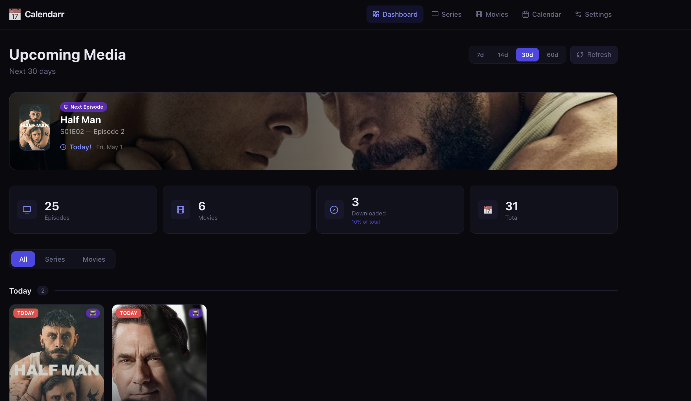
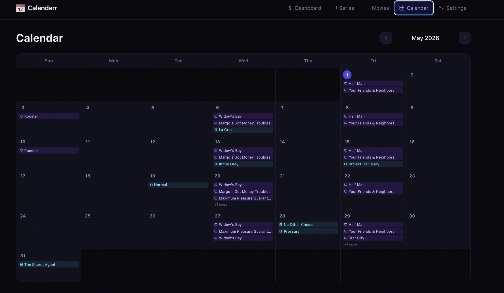
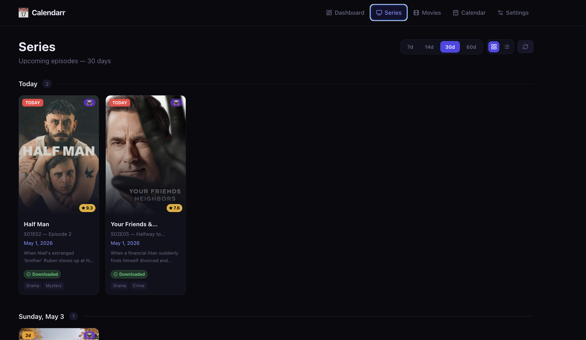
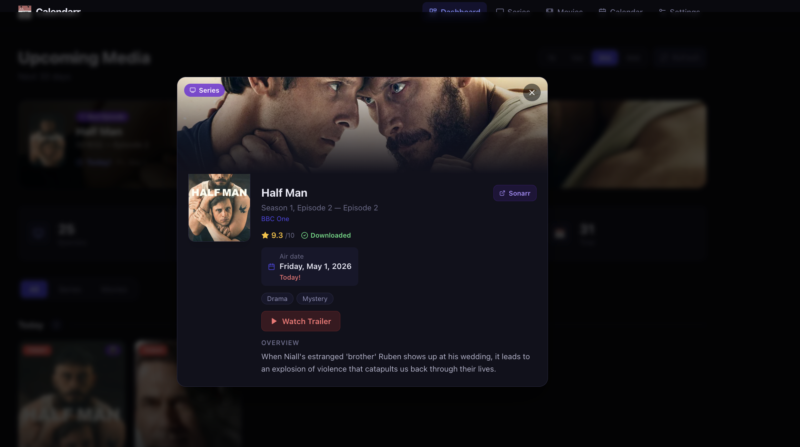

<div align="center">
  <h1>📅 Calendarr</h1>
  <p><strong>A beautiful media calendar for Sonarr & Radarr</strong></p>
  <p>Track upcoming TV episodes and movies with posters, ratings, trailers, and Discord notifications — all in one dark-themed dashboard.</p>

  
  
  
  
</div>

---

## ✨ Features

- **📺 Upcoming Episodes** — See all Sonarr episodes in the next 7–60 days, grouped by date or series
- **🎬 Upcoming Movies** — Track Radarr movies with cinema / digital / physical release filters
- **📅 Calendar View** — Monthly grid with episodes and movies shown on their air dates, click to open details
- **🎯 Next Up Widget** — Hero banner on the dashboard showing the very next item with a live countdown timer
- **📥 Recently Downloaded** — Horizontal strip of the latest downloads from both Sonarr and Radarr
- **🎭 TMDB Enrichment** — Auto-fetches posters, backdrops, ratings, genres, runtime and overview for every item
- **🎬 Trailers** — YouTube trailer button directly in the detail modal (via TMDB)
- **🔔 Discord Notifications** — Daily digest with configurable time, showing what's coming with relative dates (e.g. "Sunday, in 2d")
- **⚙️ Settings UI** — Configure Sonarr, Radarr, TMDB, and Discord entirely from the web interface — no config files needed
- **🔗 Deep Links** — Open any item directly in Sonarr or Radarr from the detail modal
- **📱 PWA** — Installable as a home screen app on mobile
- **🕹️ Configurable Range** — Switch between 7 / 14 / 30 / 60 day windows on any page
- **✅ Download Status** — Every card shows Downloaded / Monitored / Unmonitored status at a glance

---

## 📸 Screenshots

| Dashboard | Calendar |
|-----------|----------|
|  |  |

| Media Grid | Detail Modal |
|------------|--------------|
|  |  |

---

## 🚀 Installation

### Requirements

- Docker
- A running [Sonarr](https://sonarr.tv) instance
- A running [Radarr](https://radarr.video) instance
- (Optional) [TMDB API key](https://www.themoviedb.org/settings/api) for posters & metadata
- (Optional) Discord webhook URL for daily digests

### Docker Run

```bash
docker run -d \
  --name calendarr \
  --restart unless-stopped \
  -p 8484:3000 \
  -v /path/to/data:/app/data \
  -e NODE_ENV=production \
  ghcr.io/mariusfunie/calendarr:latest
```

Then open **http://localhost:8484** and configure your API keys in Settings.

### Docker Compose

```yaml
services:
  calendarr:
    image: ghcr.io/mariusfunie/calendarr:latest
    container_name: calendarr
    ports:
      - "8484:3000"
    volumes:
      - /path/to/data:/app/data
    environment:
      - NODE_ENV=production
    restart: unless-stopped
```

### Build from Source

```bash
git clone https://github.com/mariusfunie/calendarr.git
cd calendarr

# Development
npm install
npm run dev

# Production Docker build
docker build -t calendarr .
docker run -d --name calendarr -p 8484:3000 -v ./data:/app/data calendarr
```

---

## ⚙️ Configuration

All settings are configured through the **Settings page** in the UI — no environment variables or config files required.

| Setting | Description |
|---------|-------------|
| **Sonarr URL** | Base URL of your Sonarr instance (e.g. `http://192.168.1.100:8989`) |
| **Sonarr API Key** | Found in Sonarr → Settings → General |
| **Radarr URL** | Base URL of your Radarr instance (e.g. `http://192.168.1.100:7878`) |
| **Radarr API Key** | Found in Radarr → Settings → General |
| **TMDB API Key** | From [themoviedb.org/settings/api](https://www.themoviedb.org/settings/api) — enables posters, ratings, trailers |
| **Discord Webhook** | Webhook URL for daily digest notifications |
| **Digest Time** | Time to send the daily Discord digest (e.g. `08:00`) |

Settings are stored in `/app/data/settings.json` inside the container (persisted via the volume mount).

---

## 🗂️ Pages

| Page | URL | Description |
|------|-----|-------------|
| Dashboard | `/` | Overview with Next Up widget, stats, recently downloaded, and full upcoming list |
| Series | `/series` | Upcoming episodes grouped by date or by series |
| Movies | `/movies` | Upcoming movies with release type filter (cinema/digital/physical) |
| Calendar | `/calendar` | Monthly calendar grid view |
| Settings | `/settings` | API keys and notification configuration |

---

## 🛠️ Tech Stack

- **[Next.js 15](https://nextjs.org)** — App Router, server components, API routes
- **[TypeScript](https://www.typescriptlang.org)** — Full type safety
- **[Tailwind CSS](https://tailwindcss.com)** — Dark cinema-inspired theme
- **[TMDB API](https://www.themoviedb.org/documentation/api)** — Posters, backdrops, ratings, genres, trailers
- **[Sonarr v3 API](https://sonarr.tv)** — TV episode calendar and history
- **[Radarr v3 API](https://radarr.video)** — Movie calendar and history
- **[node-cron](https://github.com/node-cron/node-cron)** — Scheduled Discord digest
- **[Docker](https://docker.com)** — Multi-stage build, standalone Next.js output

---

## 📄 License

MIT
